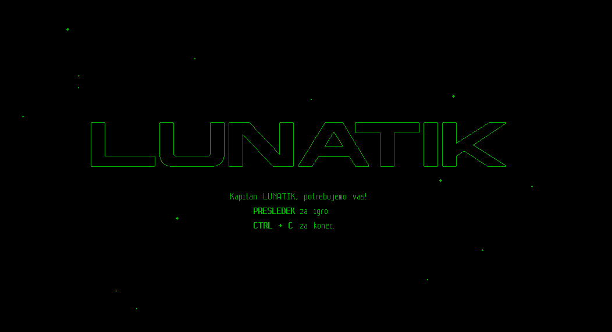
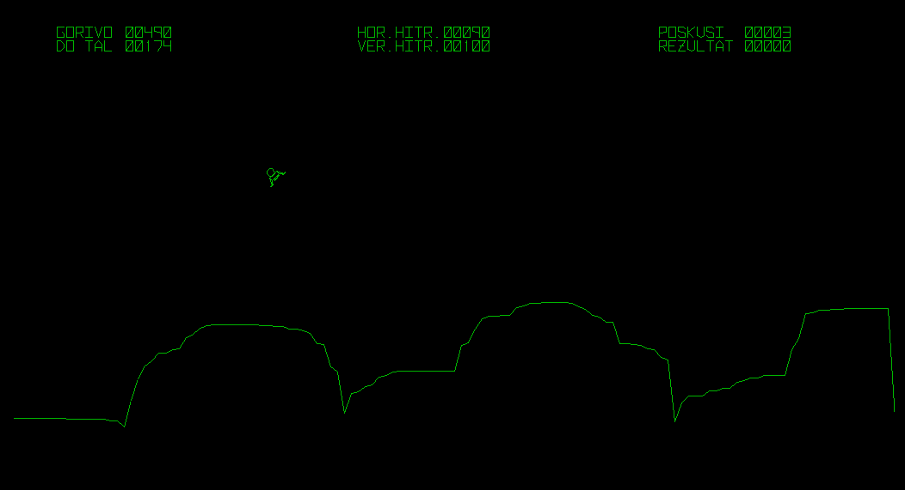
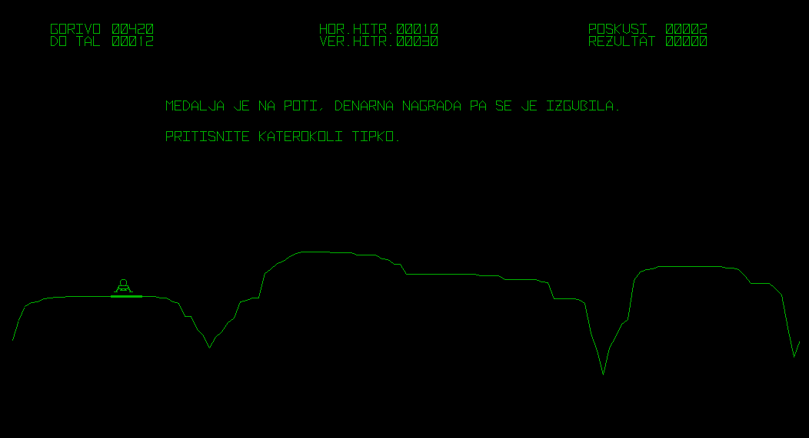
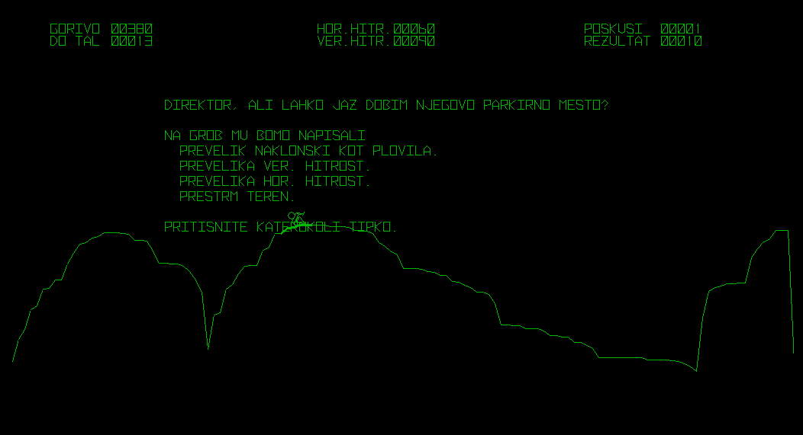

![status.badge] [![language.badge]][language.url] [![standard.badge]][standard.url] [![license.badge]][license.url]

# lunatik

This repository contains the Moon Lander game source code for the Iskra Delta Partner computer.

## Compiling

*To compile the Lunatik, you will need a Linux machine with the latest version of the SDCC suite.*

Use `make` to compile the Lunatik. 

Afterwards, you can find the disk image in the `bin/` directory and the `lunatik.com` file in the `build/` directory.

## Screenshots

[language.url]:   https://en.wikipedia.org/wiki/ANSI_C
[language.badge]: https://img.shields.io/badge/language-C-blue.svg

[standard.url]:   https://en.wikipedia.org/wiki/C89/
[standard.badge]: https://img.shields.io/badge/standard-C89-blue.svg

[license.url]:    https://github.com/tstih/libcpm3-z80/blob/main/LICENSE
[license.badge]:  https://img.shields.io/badge/license-MIT-blue.svg

[status.badge]:  https://img.shields.io/badge/status-stable-dkgreen.svg
